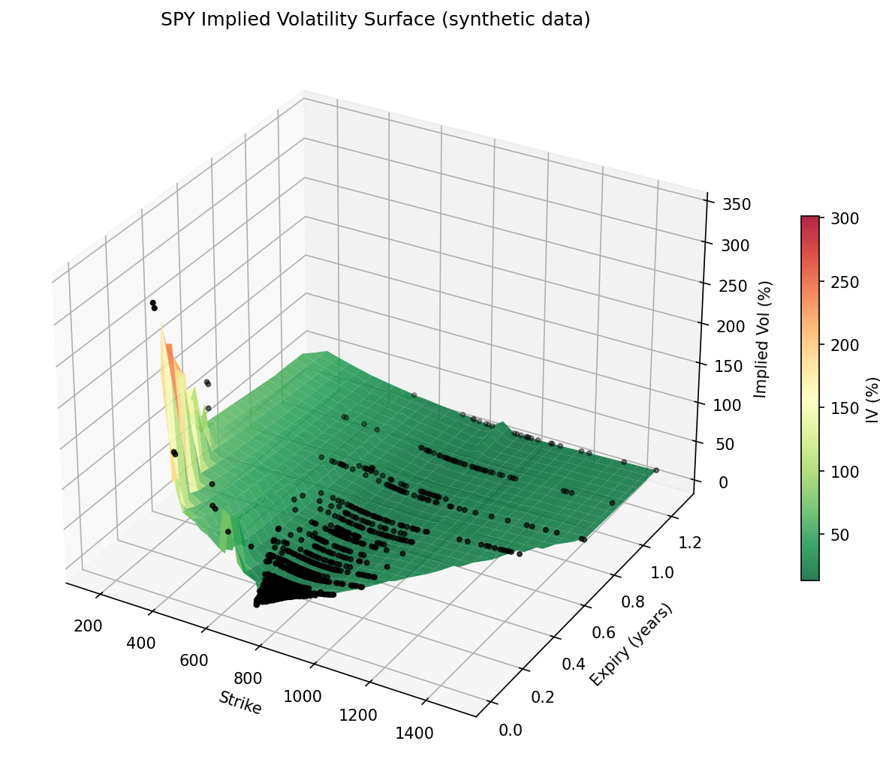

# options-pricer

A Python library for pricing European and American options using four independent numerical methods, with an implied volatility solver and vol surface fitting from real market data.

Built as a quantitative finance portfolio project targeting quant research roles.




---

## Methods

| Method | Type | European | American | Key parameters |
|--------|------|----------|----------|----------------|
| Black-Scholes | Analytic | ✅ | ❌ | — |
| Monte Carlo | Simulation | ✅ | ❌ | antithetic variates, control variate |
| Binomial (CRR) | Tree | ✅ | ✅ | N steps |
| Crank-Nicolson | PDE / FD | ✅ | ✅ | m spatial × n time nodes |

---

## Results

Reference contract: `S=100, K=100, T=1yr, r=5%, σ=20%, q=0%`

### Call price

| Method | Price | \|Error vs BS\| | Parameters |
|--------|-------|----------------|------------|
| Black-Scholes (exact) | **10.4506** | — | — |
| Binomial (CRR) | 10.4466 | 4.00 × 10⁻³ | N = 500 steps |
| Crank-Nicolson | 10.4526 | 2.05 × 10⁻³ | 200 × 200 grid |
| Monte Carlo | 10.4563 | 5.70 × 10⁻³ | 500,000 paths |

### Put price

| Method | Price | \|Error vs BS\| | Parameters |
|--------|-------|----------------|------------|
| Black-Scholes (exact) | **5.5735** | — | — |
| Binomial (CRR) | 5.5695 | 4.00 × 10⁻³ | N = 500 steps |
| Crank-Nicolson | 5.5747 | 1.22 × 10⁻³ | 200 × 200 grid |
| Monte Carlo | 5.5734 | 1.30 × 10⁻⁴ | 500,000 paths |

### Greeks (call, Black-Scholes)

| Greek | Value | Definition |
|-------|-------|------------|
| Delta (Δ) | 0.6368 | ∂V/∂S |
| Gamma (Γ) | 0.0188 | ∂²V/∂S² |
| Theta (Θ) | −0.0176 | ∂V/∂t (per day) |
| Vega (ν) | 0.3752 | ∂V/∂σ (per 1% move) |
| Rho (ρ) | 0.5323 | ∂V/∂r (per 1% move) |

---

## Live Market Data

The library fetches real options chains from Yahoo Finance for six tickers — SPY, AAPL, QQQ, TSLA, NVDA, and GLD — via a scheduled GitHub Actions pipeline that runs every weekday morning at 8:00am UTC. Updated chain files are committed to the repo automatically, so the data is always current without manual intervention.

| Ticker | Description | Vol profile |
|--------|-------------|-------------|
| SPY | S&P 500 ETF | Low vol, strong put skew (institutional hedging) |
| QQQ | Nasdaq-100 ETF | Moderate vol, put skew |
| AAPL | Apple Inc. | Moderate vol, call skew (earnings speculation) |
| TSLA | Tesla Inc. | High vol (~70% ATM IV), pronounced call skew |
| NVDA | Nvidia Corp. | Very high vol, strong call skew (AI speculation) |
| GLD | Gold ETF | Low-moderate vol, near-symmetric smile (safe haven asset) |

The six tickers span the volatility spectrum — from low-vol index ETFs to high-vol single stocks and a commodity ETF — producing meaningfully different implied volatility surfaces and skew profiles.

The risk-free rate is pulled automatically from the 13-week T-bill yield (^IRX) and the dividend yield from yfinance's trailing annual figure, so no manual inputs are required.

To fetch the latest data manually:

```bash
PYTHONPATH=. python3 -m data.fetch --ticker SPY --output data/spy_chain.csv
PYTHONPATH=. python3 -m data.fetch --ticker NVDA --output data/nvda_chain.csv
PYTHONPATH=. python3 -m data.fetch --ticker GLD --output data/gld_chain.csv
```

---
---

## Mispricing Scanner

`data/scanner.py` runs after each daily fetch and compares each contract's implied volatility to the ATM IV for the same expiry. Rather than comparing to historical vol (which would flag almost everything due to the permanent volatility risk premium), this detects genuine skew anomalies — contracts that are unusually cheap or expensive relative to what the rest of that expiry's smile is pricing.

```bash
PYTHONPATH=. python3 -m data.scanner --ticker SPY --chain data/spy_chain.csv
```

Results are committed daily to `data/spy_signals.csv`, `data/aapl_signals.csv`, `data/qqq_signals.csv`, and `data/tsla_signals.md`.

### Interpreting the output

**Put skew dominance is expected for index options.** SPY puts consistently show elevated IV vs ATM because institutional investors buy OTM puts as portfolio hedges, creating persistent demand that inflates put prices. A typical daily report flags significantly more puts than calls — this is normal market structure, not a pricing error.

**The signal is most useful day-over-day.** A single day's output tells you the current skew profile. What's more informative is when the skew widens or narrows sharply relative to recent days — a sudden spike in OTM put IV can indicate institutional hedging demand ahead of a risk event (earnings, FOMC, geopolitical events), while a compression in put skew can indicate reduced tail-risk concern.

**Filters applied to reduce noise:**
- Contracts with less than 14 days to expiry are excluded (short-dated IV is unreliable)
- Only contracts within ±10% of spot are considered (avoids deep ITM artefacts)
- Contracts with mid price below $0.50 are excluded (penny options have wide spreads)
- Minimum volume of 10 contracts required

---

## Mathematical Background

### Black-Scholes

Under the risk-neutral measure the stock follows geometric Brownian motion:

```
dS = (r − q) S dt + σ S dW
```

The closed-form price for a European call is:

```
C = S e^{−qT} N(d₁) − K e^{−rT} N(d₂)

d₁ = [ln(S/K) + (r − q + σ²/2) T] / (σ√T)
d₂ = d₁ − σ√T
```

Put price follows from put-call parity: `C − P = S e^{−qT} − K e^{−rT}`

### Monte Carlo

Simulate N terminal stock prices under the risk-neutral measure:

```
S_T = S exp[(r − q − σ²/2)T + σ√T Z],   Z ~ N(0,1)
```

Two variance-reduction techniques are applied:

**Antithetic variates** — for each draw Z, also simulate −Z. The positive and negative paths are negatively correlated, cutting variance roughly in half for a given sample size.

**Control variate** — the discounted digital payoff `e^{−rT} 1_{S_T > K}` has a known expectation `e^{−rT} N(d₂)`. Regressing the option payoff onto this control and subtracting the residual reduces variance further, typically by 90%+ near the money.

### Cox-Ross-Rubinstein Binomial Tree

The tree is parameterised by:

```
u = exp(σ√Δt),   d = 1/u,   q = (exp((r−q)Δt) − d) / (u − d)
```

The implementation uses **O(N) memory** by maintaining a single array of length N+1 updated backwards from expiry. Early exercise for American options is enforced at each step by taking `max(continuation value, intrinsic value)`.

### Crank-Nicolson PDE Solver

The Black-Scholes PDE is solved on a **log-price grid** `x = ln S`, which gives constant PDE coefficients:

```
∂V/∂t + ½σ²(∂²V/∂x²) + (r − q − ½σ²)(∂V/∂x) − rV = 0
```

Crank-Nicolson (θ = 0.5) splits each time step 50/50 between explicit and implicit, achieving **second-order accuracy in both space and time** without the instability of a fully explicit scheme. The implicit system is a tridiagonal solve at each step (O(N) via `scipy.linalg.solve_banded`). The spatial grid spans ±4σ√T (four standard deviations).

### Implied Volatility

The IV solver inverts the Black-Scholes formula using **Brent's method** bracketed on σ ∈ [10⁻⁶, 10]. Brent's method is preferred over Newton-Raphson because it is guaranteed to converge within the bracket and avoids instability near zero vega (deep ITM / very short dated). No-arbitrage bounds are validated before entering the solver.

The vol surface is fitted by first interpolating scattered chain data onto a regular (K, T) grid via cubic `griddata`, then fitting a bicubic spline — giving a smooth, differentiable surface rather than the piecewise-linear artefacts of direct scattered interpolation. Boundary NaNs are filled with nearest-neighbour values before spline fitting. The spline order degrades gracefully when the grid is small.

---

## Project Structure

```
options-pricer/
├── pricer/
│   ├── models.py            — OptionParams dataclass
│   ├── black_scholes.py     — analytic price + all 5 Greeks
│   ├── monte_carlo.py       — MC with antithetic variates + control variate
│   ├── binomial.py          — CRR binomial tree (European + American)
│   ├── finite_difference.py — Crank-Nicolson PDE solver (European + American)
│   └── implied_vol.py       — IV solver (Brent) + vol surface fitting
├── data/
│   ├── fetch.py             — pull options chain via yfinance
│   ├── scanner.py           — IV skew anomaly scanner
│   ├── spy_chain.csv        — SPY chain (auto-updated daily)
│   ├── aapl_chain.csv       — AAPL chain (auto-updated daily)
│   ├── qqq_chain.csv        — QQQ chain (auto-updated daily)
│   ├── tsla_chain.csv       — TSLA chain (auto-updated daily)
│   ├── spy_signals.csv/md   — SPY scanner output (auto-updated daily)
│   ├── aapl_signals.csv/md  — AAPL scanner output (auto-updated daily)
│   ├── qqq_signals.csv/md   — QQQ scanner output (auto-updated daily)
│   └── tsla_signals.csv/md  — TSLA scanner output (auto-updated daily)
├── tests/
│   ├── test_black_scholes.py
│   ├── test_monte_carlo.py
│   ├── test_binomial.py
│   ├── test_finite_difference.py
│   ├── test_implied_vol.py
│   └── test_parity.py       — cross-method put-call parity checks
├── notebooks/
│   ├── 01_pricing_comparison.ipynb
│   ├── 02_vol_surface.ipynb
│   └── 03_greeks_analysis.ipynb
├── pyproject.toml
├── .github/workflows/ci.yml
└── .github/workflows/fetch_data.yml
```

---

## Installation

Requires Python 3.11+.

```bash
git clone https://github.com/jaamesm/options-pricer.git
cd options-pricer
pip install -e ".[dev]"
```

---

## Usage

```python
from pricer.models import OptionParams
from pricer.black_scholes import price, greeks
from pricer import monte_carlo as mc, binomial, finite_difference as fd
from pricer import implied_vol as iv

p = OptionParams(S=100, K=100, T=1.0, r=0.05, sigma=0.2)

# Analytic
print(price(p, "call"))          # 10.4506
print(greeks(p, "call"))         # {'delta': 0.637, 'gamma': 0.019, ...}

# Monte Carlo
result = mc.price(p, "call", n=500_000, seed=42)
print(result["price"], result["se"])

# Binomial — European and American
print(binomial.price(p, "call", n=500, exercise="european"))
print(binomial.price(p, "put",  n=500, exercise="american"))

# Crank-Nicolson
print(fd.price(p, "call", m=200, n=200))

# Implied volatility round-trip
from pricer.black_scholes import price as bs_price
mkt = bs_price(p, "call")
print(iv.solve(p, mkt, "call"))  # recovers 0.2000
```

### Fetch a live options chain

```bash
# SPY (default)
PYTHONPATH=. python3 -m data.fetch --ticker SPY --output data/spy_chain.csv

# Any ticker
PYTHONPATH=. python3 -m data.fetch --ticker AAPL --output data/aapl_chain.csv
```

---

## Tests

```bash
pytest tests/          # 87 tests, 97% coverage
pytest tests/ --cov=pricer --cov-report=term-missing
```

The test suite covers:

- Known analytic values (ATM call = 10.4506)
- Put-call parity across all four methods
- American put ≥ European put
- American call = European call when q = 0
- IV round-trip accuracy to 10⁻⁶ across σ ∈ [0.05, 0.60]
- Variance reduction (antithetic variates, control variate)
- No-arbitrage bound enforcement in the IV solver
- Monotonicity: price increases with σ and T

---

## Limitations

- **No smile in pricing** — Black-Scholes, MC, binomial, and CN all assume constant volatility. Real markets exhibit a volatility smile/skew.
- **European MC only** — the Monte Carlo pricer does not support American exercise (no Longstaff-Schwartz).
- **No path-dependent products** — Asian, barrier, and lookback options are not implemented.
- **Constant rates and dividends** — the model does not support term structures for r or q.
- **No calibration** — the library solves for IV given a price, but does not calibrate a parametric smile model (e.g. SVI, SABR).

---

## References

- Black, F., Scholes, M. (1973). *The Pricing of Options and Corporate Liabilities.* Journal of Political Economy, 81(3), 637–654.
- Cox, J.C., Ross, S.A., Rubinstein, M. (1979). *Option pricing: A simplified approach.* Journal of Financial Economics, 7(3), 229–263.
- Wilmott, P., Howison, S., Dewynne, J. (1995). *The Mathematics of Financial Derivatives.* Cambridge University Press.
- Duffy, D.J. (2006). *Finite Difference Methods in Financial Engineering.* Wiley.
- Glasserman, P. (2003). *Monte Carlo Methods in Financial Engineering.* Springer.
